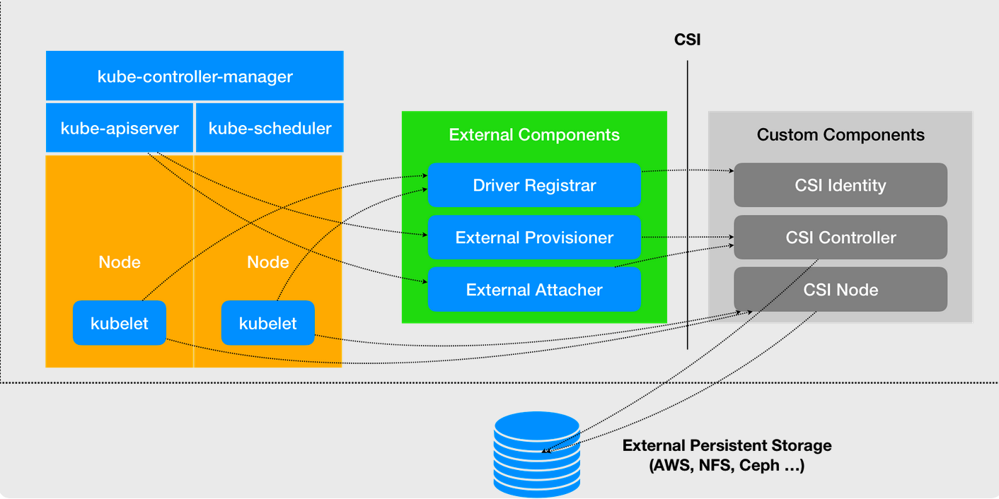
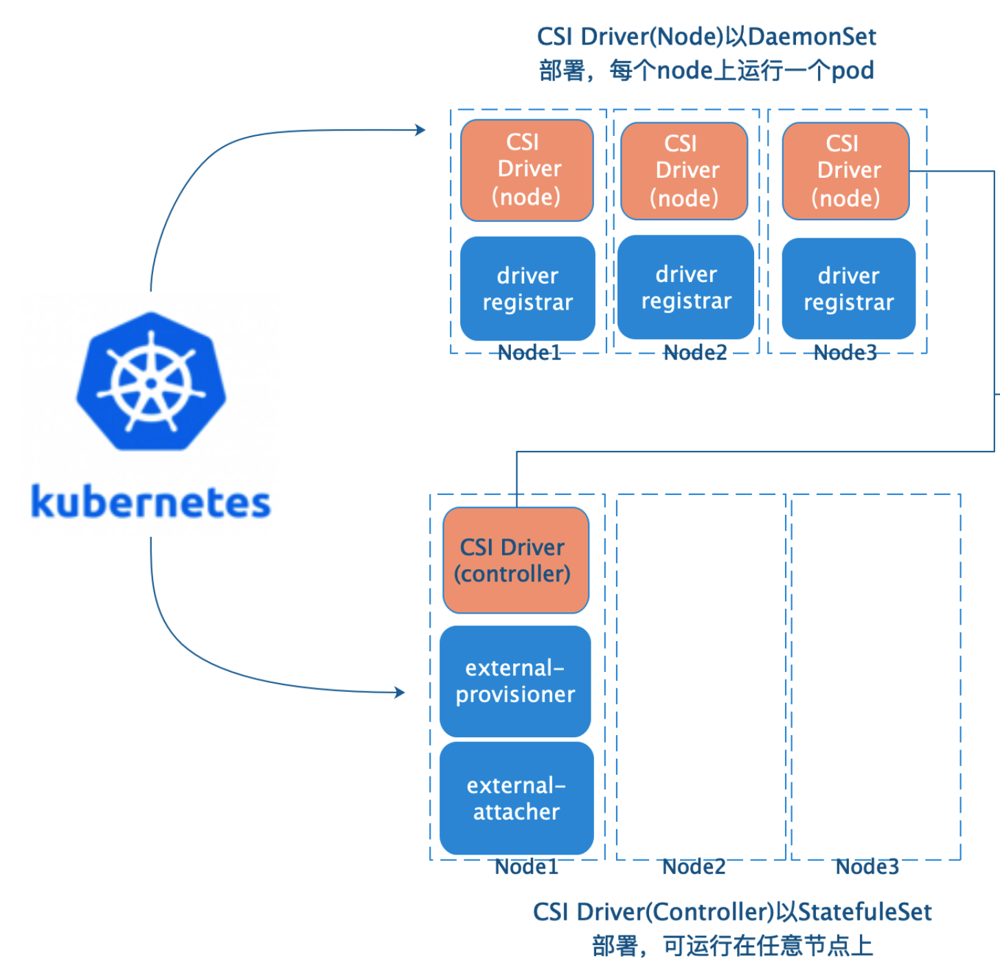

# CSI

CSI的设计思想把插件的职责从“两阶段处理”，扩展成了Provision、Attach和Mount三个阶段：

- Provision用于于“创建volume”
- Attach用于“attach volume到node上”
- Mount用于“将该volume格式化后，mount到容器volume对应的宿主机目录上”

## 主要组件

### External Components

External components可以认为是CSI在k8s中的controller，它由以下3个组件组成：

- Driver Registrar：将某个CSI插件（custom components）注册到kubelet里面
- External Provisioner：负责的是Provision阶段，用于创建volune
- External Attacher：负责的是Attach 阶段，用于将远程的volume attach到pod所在的节点。
- 而volume的Mount 阶段，并不属于External Components的职责，由CSI插件（custom components）中的CSI node实现。

### CSI插件（Custom Components）

- CSI Identity：负责对外暴露这个插件本身的信息。
- CSI Controller负责Volume管理流程中的“Provision 阶段”和“Attach 阶段”：
  - “Provision 阶段”：对CSI Volume的管理接口，比如：创建和删除 CSI Volume。对应的接口是CreateVolume和DeleteVolume，如块调用远程存储服务的API创建出一个存储卷。
  - “Attach 阶段”：对CSI Volume进行Attach/Dettach（在 CSI 里，这个操作被叫作 Publish/Unpublish）。对应的接口是ControllerPublishVolume和ControllerUnpublishVolume，如调用远程快存储服务的API，将先前创建的存储卷挂载到指定的节点上。
  - 对CSI Volume进行Snapshot等。 
- CSI Node包含了需要在宿主机上执行的操作，对应volume管理流程里的“Mount 阶段”。kubelet 的 VolumeManagerReconciler 控制循环会直接调用CSI Node服务来完成Volume 的“Mount 阶段”。
  - NodeStageVolume 接口的作用就是格式化 Volume 在宿主机上对应的存储设备，然后挂载到一个临时目录（Staging 目录）上。
  - SetUp 操作则会调用 CSI Node 服务的 NodePublishVolume 接口，将 Staging 目录绑定挂载到 Volume 对应的宿主机目录上。

## 部署

- 通过 DaemonSet 在每个节点上都启动一个CSI插件，来为 kubelet 提供 CSI Node 服务。
  - 在这个DaemonSet面，除了 CSI 插件还以 sidecar 的方式运行着 driver-registrar 这个外部组件。它的作用，是向 kubelet 注册这个 CSI 插件。这个注册过程使用的插件信息，则通过访问同一个 Pod 里的 CSI 插件容器的 Identity 服务获取到。
  - 在定义 DaemonSet Pod 的时候，我们需要把宿主机的 /var/lib/kubelet 以 Volume 的方式挂载进 CSI 插件容器的同名目录下，方便CSI Node 服务在“Mount 阶段”执行的挂载操作
- 通过 StatefulSet 在任意一个节点上再启动一个 CSI 插件，为 External Components 提供 CSI Controller 服务。作为 CSI Controller 服务的调用者，External Provisioner 和 External Attacher 这两个外部组件，就需要以 sidecar 的方式和这次部署的 CSI 插件定义在同一个 Pod 里。

## 具体流程

下图中的External Components是从原先的k8s master中剥离出来的部分，而Custom Component （也被称为CSI插件）是原先在k8s node的 pkg/volume/xxx目录下的二进制文件。在CSI中，CIS插件是一个二进制文件，会以容纳的形式运行，以gRPC的方式对外提供三个服务：CSI Identity、CSI Controller和CSI Node。在实际使用CSI插件的时候，会将三个External Components作为sidecar容器和CSI插件放置在同一个Pod中。由于External Components对CSI插件的调用非常频繁，所以这种sidecar的部署方式非常高效。

### Provision、Attach、Mount

- 当用户创建了一个PVC之后，部署在StatefulSet里的的External Provisioner容器就会监听到这个PVC的诞生，然后调用同一个Pod里的CSI插件的CSI Controller服务的CreateVolume方法创建PV。然后调用 CSI 插件的CSI controller创建出这个 PV 对应的CSI Volume，
- 这时运行在k8s Master节点上的 Volume Controller，就会通过PersistentVolumeController发现这对新创建出来的PV和PVC，并且看到它们声明的是同一个StorageClass。所以会把这一对PV和PVC绑定起来，使PVC进入Bound状态。
- 当使用该PVC的Pod被调度到A节点上时，Volume Controller的AttachDetachController控制循环就会发现，上述PVC对应的Volume需要被Attach到A上。AttachDetachController会创建一个VolumeAttachment对象，这个对象携带了A和待处理的Volume的名字。
- StatefulSet 里的External Attacher容器就会监听到这个VolumeAttachment对象的诞生。它使用这个对象里的Node和Volume名字，调用同一个Pod里的CSI插件的CSI Controller服务的ControllerPublishVolume方法，完成“Attach 阶段”。
- 运行在A上的kubelet就会通过VolumeManagerReconciler控制循环，发现当前node上有一个Volume对应的存储设备（比如磁盘）已经被Attach到了某个设备目录下。于是kubelet就会调用同一node上的CSI插件的CSI Node服务的NodeStageVolume和NodePublishVolume方法完成这个Volume的“Mount 阶段”。

