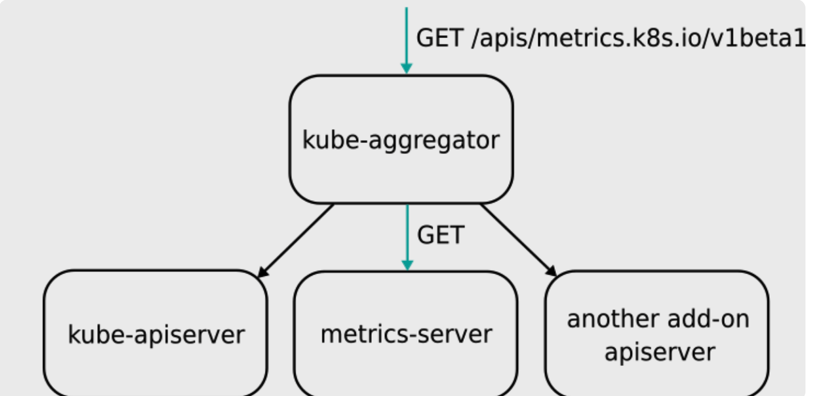

# kube-apiserver

## List-Watch

Etcd 存储集群的数据信息，而 Apiserver 作为统一入口，任何对数据的操作都必须经过 Apiserver。客户端（如kubelet、scheduler、controller-manager）通过 list-watch 监听Apiserver 中的资源（如 pod、rs、rc 等）的 create、update和 delete 事件，并针对事件类型调用相应的事件处理函数。

list-watch 有 list 和 watch 两部分组成。list 就是调用资源的list API 罗列所有资源，它基于 HTTP 短链接实现。watch 则是调用资源的 watch  API 监听资源变更事件，基于 HTTP 长链接实现。以 pod 资源为例，它的 list 和 watch API 分别为：

- List API：返回值为 PodList，即一组 pod

```http
GET /api/v1/pods
```

- Watch API：往往带上 watch=true，表示采用 HTTP 长连接持续监听 pod 相关事件。每当有新事件，返回一个 WatchEvent 。

```http
GET /api/v1/watch/pods
```

K8s 的 informer 模块封装了 list-watch API，用户只需要指定资源，编写事件处理函数 AddFunc、UpdateFunc 和DeleteFunc 等。如下图所示，informer 首先通过 list API 罗列资源，然后调用 watch  API 监听资源的变更事件，并将结果放入到一个 FIFO 队列，队列的另一头有协程从中取出事件，并调用对应的注册函数处理事件。Informer 还维护了一个只读的 Map Store 缓存，主要为了提升查询的效率，降低 Aiserver 的负载。


### Watch 的实现

Watch 是如何通过 HTTP 长链接接收 Apiserver 发来的资源变更事件呢？秘诀就是 Chunked Transfer Encoding（分块传输编码），它首次出现在HTTP/1.1 。

当客户端调用 watch API 时，Apiserver 在 response 的 HTTP  Header 中设置 Transfer-Encoding 的值为 chunked，表示采用分块传输编码。客户端收到该信息后，便和服务端该链接，并等待下一个数据块，即资源的事件信息。例如：

```shell
$ curl -i http://{kube-api-server-ip}:8080/api/v1/watch/pods?watch=yes

HTTP/1.1 200 OK
Content-Type: application/json
Transfer-Encoding: chunked
Date: Thu, 02 Jan 2019 20:22:59 GMT
Transfer-Encoding: chunked

{"type":"ADDED", "object":{"kind":"Pod","apiVersion":"v1",...}}
{"type":"ADDED", "object":{"kind":"Pod","apiVersion":"v1",...}}
{"type":"MODIFIED", "object":{"kind":"Pod","apiVersion":"v1",...}}
...
```

List-Watch 基于 HTTP 协议，是 K8s 重要的异步消息通知机制。它通过 list 获取全量数据，通过 watch  API 监听增量数据，保证消息可靠性、实时性、性能和顺序性。而消息的实时性、可靠性和顺序性又是实现声明式设计的良好前提。

## K8S Proxy API

kube-apiserver把收到的REST request转发到某个node的kubelet的REST端口上，通过k8s proxy API获得的数据来自node而非etcd。

- Authentication：

  - 最严格的HTTPS证书认证，基于CA根证书签名的双向数字证书 认证方式
  - HTTP Token认证：通过一个Token来识别合法用户
  - Http Base认证：通过用户名+密码的方式认证
- Authorization：API Server授权，包括AlwayDeny、AlwaAllow、ABAC、RBAC、WebHook
- Admission Control：k8s AC体系中的最后一道关卡，官方标准的Adminssion Control就有10个，在启动kube-apiserver时指定

## Dynamic Admission Control（Initializer）

当任何一个API对象被提交给APIServer之后，总有一些“初始化”性质的工作需要在它们被k8s正式处理之前进行。比如，自动为所有Pod加上某些标签（Labels）。而这个“初始化”操作的实现，借助的是Admission Control功能。它其实是k8s里一组被称为Admission Controller的代码，可以选择性地被编译进APIServer中，在API对象创建之后会被立刻调用到。k8s提供了一种“热插拔”式的Admission机制，它就是Dynamic Admission Control，也叫作：Initializer。

 Initializer也是一个controller，实时查看用户给APIServer的请求，遇到实际状态与期望值不同时，更新用户API对象。更新用户的API对象的时候，使用PATCH API来完成merge工作。而这种PATCH API，正是声明式API最主要的能力。Initializer会再创建一个新的对象，然后通过TwoWayMergePatch和PATCH API把两个API对象merge，完成类似注入的操作。

## Aggregated API

APIServer Aggregator的设计思路是允许用户编写一个自定义的 APIServer，在这里面添加自定义 API。这个APIServer就可以跟k8s原生的APIServer绑定部署在一起统一提供服务了。同时，构建出的API接口更加规范整齐，能利用k8s原生的认证、授权、准入机制。

不同于CRD，Aggregated APIServer中的API资源是通过代码向k8s注册资源类型的方式实现的，而CRD是直接通过yaml文件创建自定义资源的方式实现的。



## URL

- `kubectl proxy --port=8080`: create a local proxy for the local `kubelet` `API server`
- `curl 127.0.0.1:8080/api`
- `curl 127.0.0.1:8080/api/v1`
- `curl 127.0.0.1:8080/api/v1/pods`
